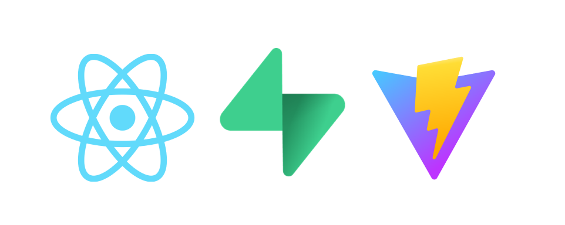

<p align="center">
<h1 align="center">React + TS + Supabase + Vite</h1>
</p>

<p align="center">

</p>

[**`🌐 App Demo`**](https://nest-react-monorepo.vercel.app/)

## Features

- 🚀 Protected Routes
- 🚀 Supabase Session Object in Global Context via `useSession`
- 🚀 User Authentication
- 🚀 Routing and Route Guards

It's also blazingly fast 🔥 No really, [try it out for yourself.](https://react-supabase-auth-template.vercel.app/)

## Getting Started

### Setting up Supabase

- Create a new Supabase project [here](https://supabase.com/dashboard/new)
  - Create a new account and organisation if required
  - Select the appropriate region
  - Note the project URL and anon key in `Project settings > API`

### Setting up the web app

- Clone the repository
- Install dependencies: `npm install`
  - This can be run from the root directory as part of the workspaces setup
- Create `.env` using the `.env.example` as a template

```bash
# Replace with your Supabase project URL
VITE_SUPABASE_URL=
# Replace with your Supabase anon key
VITE_SUPABASE_ANON_KEY=
```

- Run the app: `npm run dev`

### Deployment

- Create an account and project at 

## What you need to know

- `/router/index.tsx` is where you declare your routes
- `/context/SessionContext.tsx` is where you can find the `useSession` hook
  - This hook gives you access to the `session` object from Supabase globally
- `/Providers.tsx` is where you can add more `providers` or `wrappers`
